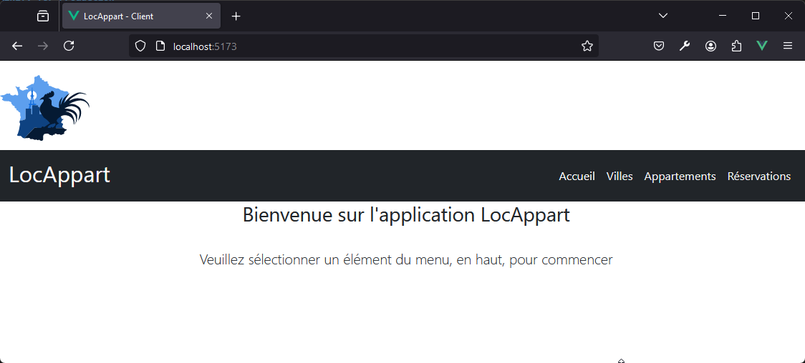
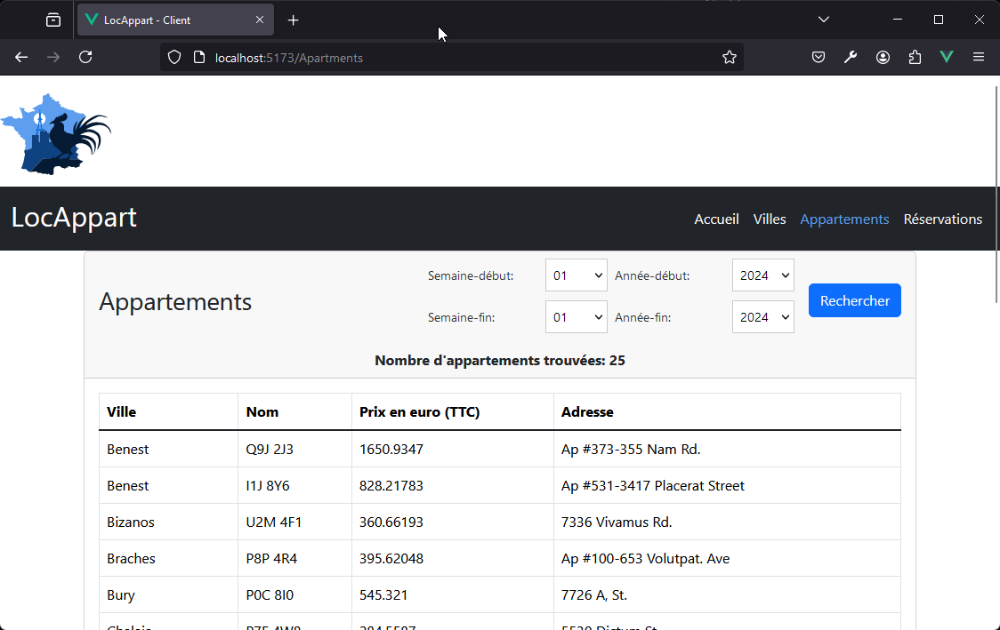
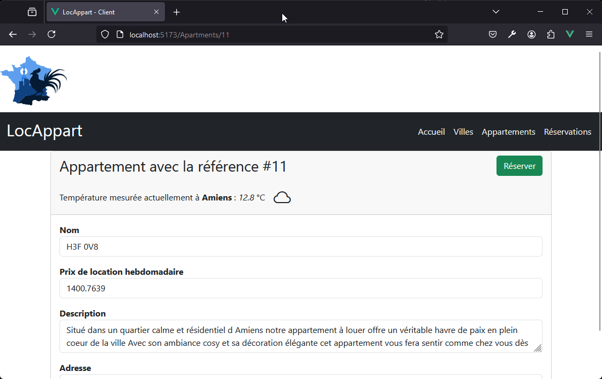
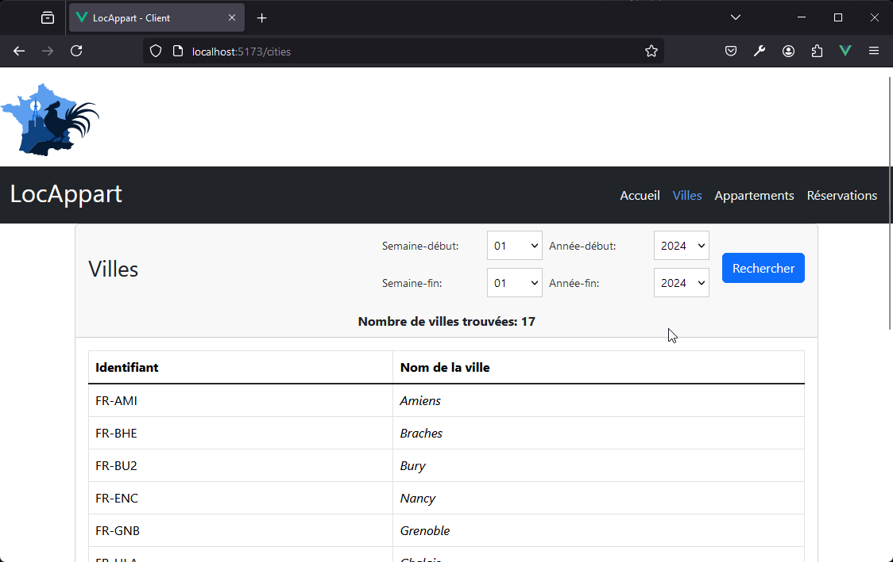
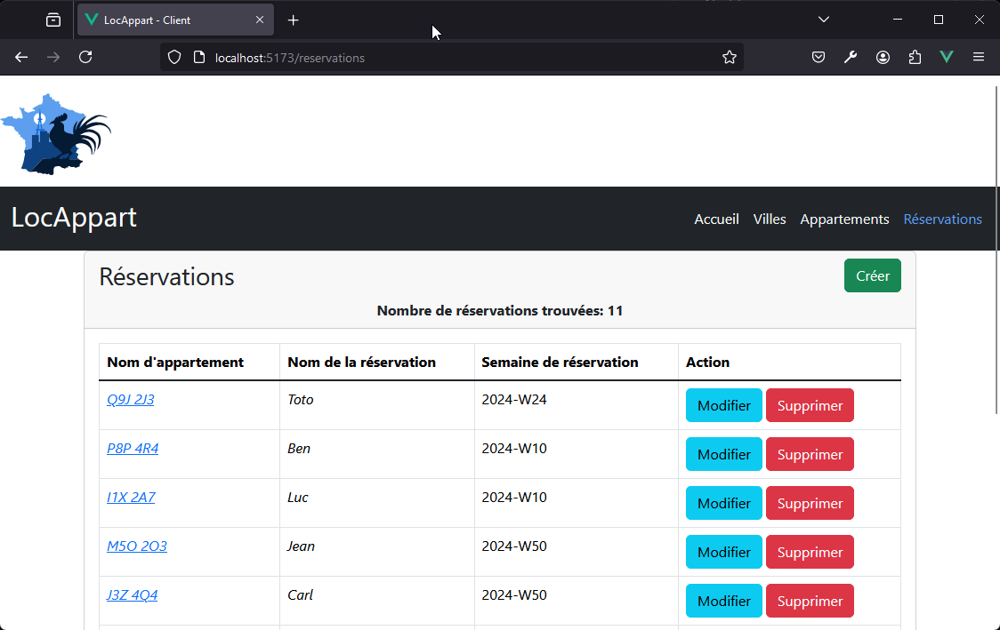

<p align="center"></p> 
<h2 align="center"><b>D314 - Locapart - Client</b></h2>
<h4 align="center">Application cliente pour le projet D314 Locapart.</h4>


<hr>
<p align="center"><a href="#screenshots">Screenshots</a> &bull; <a href="#description">Description</a> &bull; <a href="#features">Fonctionnalités</a> &bull; <a href="#installation-and-updates">Installations et mise à jour</a> &bull; <a href="#contribution">Remerciements</a> &bull; <a href="#license">License</a></p>
<hr>

## Screenshots

[](screenshots/acceuil.png)
[](screenshots/appartements.png)
[](screenshots/appartement_detail.png)
[](screenshots/villes.png)
[](screenshots/reservations.png)

## Description

L'application est un site web où l'on peut louer des appartements dans des villes de France.
L'application a été pensé et configuré pour le service API dans le repo github suivant: [D314 locapart service](https://github.com/tsitokely/d314_locapart_intelliJ) ainsi que l'api méteo disponible sur le lien suivant [Open méteo-Méteo France](https://open-meteo.com/en/docs/meteofrance-api). 
En ce sens, pour l'utiliser pour d'autres services, il faudra faire des ajustements.


### Fonctionnalités

* Lister les villes disponibles sur le service (villes non ajoutables depuis le front-end)
* Lister les appartements disponibles sur le service (appartements non ajoutables depuis le front-end)
* Lister, créer, modifier et supprimer les réservations faites sur le service

## Installations et mise à jour

### Installation des modules requis
1. Avant toute installation, veuillez vous asssurer que le service API est fonctionnel, puis notez son addresse http
2. Prenez le package de l'application, puis en naviguant dans le répetoire de base, ouvrez le fichier `.env`
3. Modifier le fichier `.env` selon l'addresse du service ainsi que l'api méteo
```sh
VITE_APP_API_BASE_URL=http://localhost:8080/WSLocaPart_war_exploded/api
VITE_APP_API_WEATHER_URL=https://api.open-meteo.com/v1/meteofrance
```
4. Pour installer les dépendances nécessaire, il faut lancer la commande suivante dans le répertoire de l'application

```sh
npm install
```

### Developement
Pour faire les développements, il suffit de lancer la commande suivante dans le répertoire de l'application
```sh
npm run dev
```

### Mise en production
Pour la mise en production, il suffit de lancer la commande suivante dans le répertoire de l'application
```sh
npm run build
```

## Contribution
Que vous ayez des idées, des traductions, des changements de conception, du nettoyage de code ou de véritables changements de code, l'aide est toujours la bienvenue.
Plus on en fait, mieux c'est !

Si vous souhaitez vous impliquer, envoyez-moi un message.

## Remerciements

*Mes remerciements les plus chaleureux à l'équipe d'Open Méteo sans qui je n'aurais pu faire ce projet.*

*Vous pouvez utiliser leur service en allant sur leur site web*

[](https://open-meteo.com/)  


## License

"Locapart - client" is an application that allows you to rent apartments through the call of a specific REST service
Copyright (C) 2024 Tsitohaina Toetra Rakotondramasy

This program is free software: you can redistribute it and/or modify
it under the terms of the GNU General Public License as published by
the Free Software Foundation, either version 3 of the License, or
(at your option) any later version.

This program is distributed in the hope that it will be useful,
but WITHOUT ANY WARRANTY; without even the implied warranty of
MERCHANTABILITY or FITNESS FOR A PARTICULAR PURPOSE.  See the
GNU General Public License for more details.

You should have received a copy of the GNU General Public License
along with this program.  If not, see <https://www.gnu.org/licenses/>.

The application is a free Software: You can use, study share and improve it at yourwill. Specifically you can redistribute and/or modify it under the terms of the [GNU General Public License](https://www.gnu.org/licenses/gpl.html) as
published by the Free Software Foundation, either version 3 of the License, or
(at your option) any later version.  
